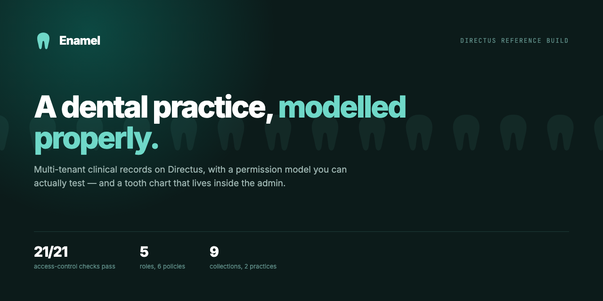
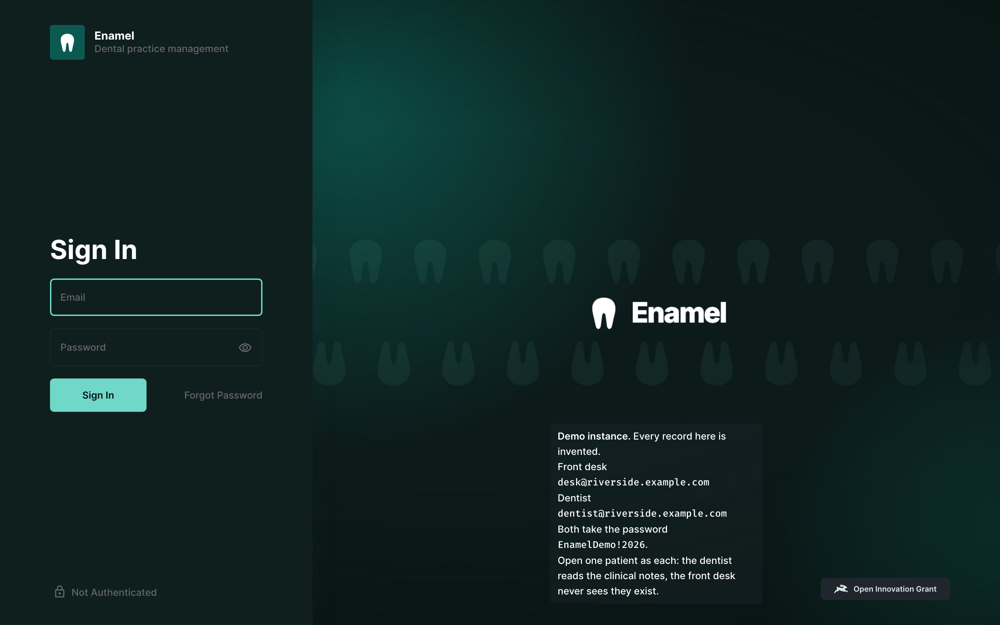
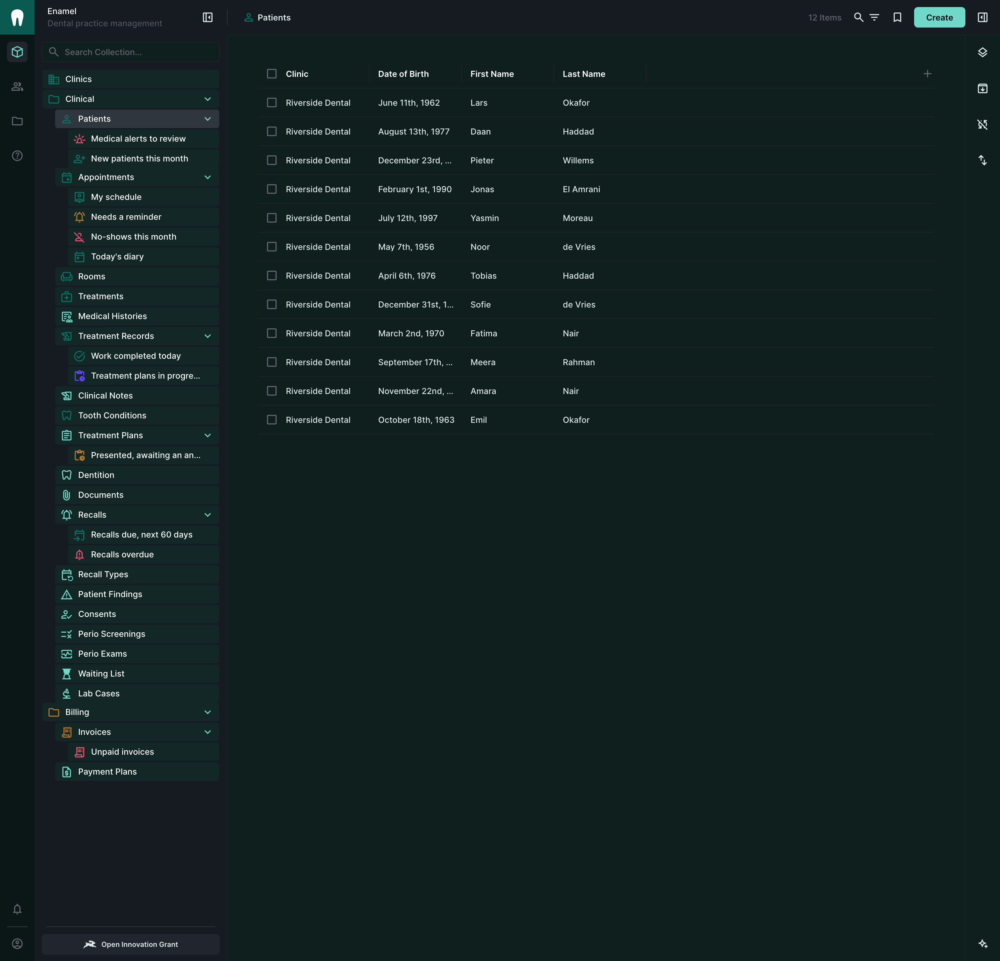
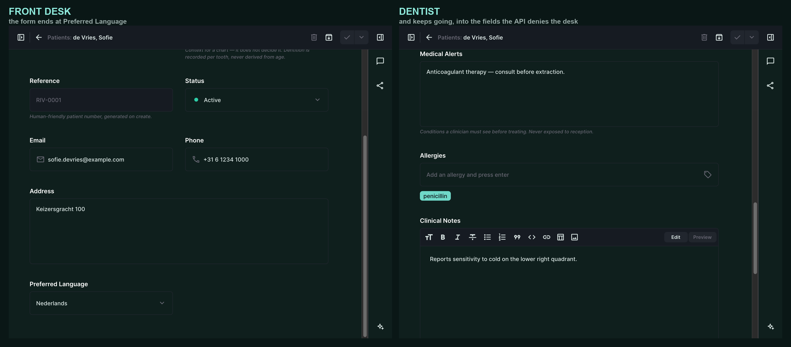
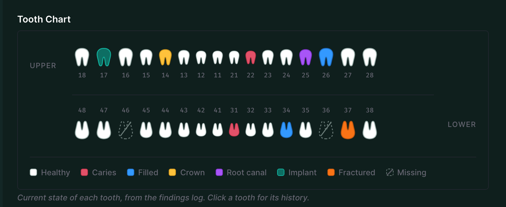
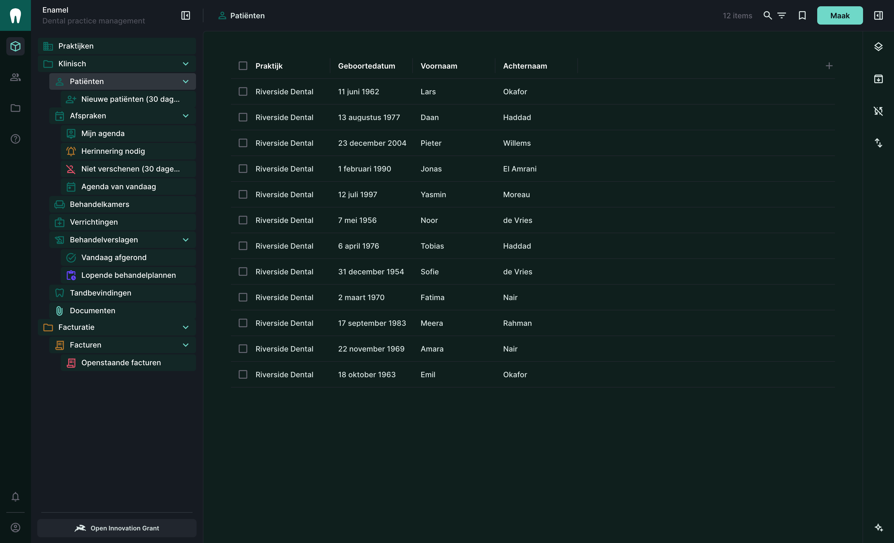
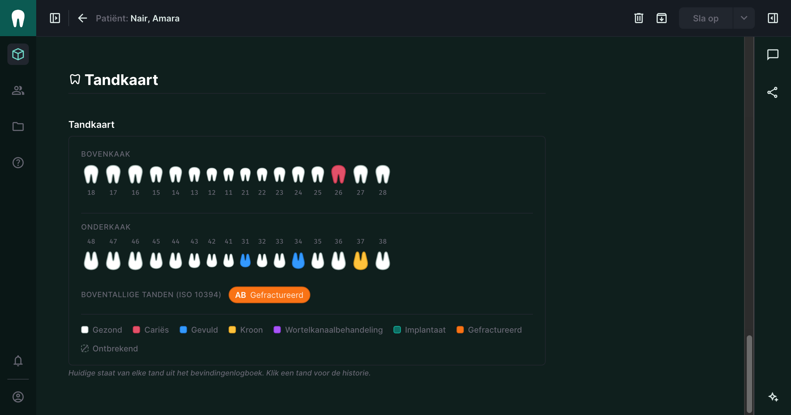

<p align="center">
  
</p>

<h1 align="center">Enamel</h1>

<p align="center">
  A multi-tenant dental practice management backend on <a href="https://directus.io">Directus</a> —
  built to show what a properly modelled schema and a tested permission model look like.
</p>

<p align="center">
  
  
  
</p>

---

## Why this exists

Most Directus demos show a blog. A blog has one kind of user and nothing worth
protecting, so it never has to answer the question that actually decides whether
a project succeeds: **who can see which fields, and how do you know?**

A dental practice has to answer it on day one. The receptionist books the
appointment and takes the payment, so she needs the patient list. She has no
business reading the medical alerts. The hygienist needs the clinical record and
has no business seeing the invoice. Get that wrong and you have either a
practice that can't work or a data-protection incident.

Enamel is that problem, solved in Directus, with the solution tested.

## Branding

<p align="center">
  
</p>

The identity is applied **through the API in [`branding.ts`](bootstrap/src/branding.ts)**,
not clicked into a browser session — so a clone gets the same login screen and
the same admin chrome as everyone else, and a rebuild never loses it.

Directus gives you more hooks than most people use: `project_logo` and
`project_color` for the admin nav, `public_favicon` for the browser tab,
`public_background` and `public_foreground` for the login screen, `public_note`
for the sign-in message, and `theme_light_overrides` / `theme_dark_overrides`,
which restyle the entire admin without a line of custom CSS.

<p align="center">
  
</p>

Only the tokens that carry the identity are overridden, so the admin keeps
working across Directus upgrades instead of fighting them. Source assets —
mark, logo, palette — are in [`brand/`](brand).

The whole kit is uploaded into a **Branding** folder rather than the root of
the file library, which is where a practice's scans and referral letters land;
an admin who cannot tell the logo from a patient document eventually deletes
the wrong one. Nine assets go in — the four Directus references plus both
vector marks and the icon set — and an instance provisioned before the folder
existed moves its files in on the next run instead of keeping two homes for
them.

## The one thing to look at

<p align="center">
  
</p>

Same patient, same URL, two logins. On the left the form simply **ends** after
Preferred Language — there is no Clinical section, no medical alerts, no tooth
chart. That is not a hidden `div` or an `if` in a frontend. The API refuses the
fields, so a curl request gets the same answer:

```console
$ curl -H "Authorization: Bearer $FRONT_DESK" \
    "$API/items/patients?limit=1&fields=id,medical_alerts"
{"errors":[{"message":"You don't have permission to access field \"medical_alerts\" …"}]}
```

It comes from about six lines in [`access/policies.ts`](bootstrap/src/access/policies.ts):

```ts
const FRONT_DESK_PATIENT_FIELDS = [
  "id", "clinic", "reference", "status",
  "first_name", "last_name", "date_of_birth",
  "email", "phone", "address", "preferred_language",
  // medical_alerts, allergies and clinical_notes are absent on purpose.
];
```

## Everything here is tested

A permission model you have not tried to break is a hope, not a policy.
`pnpm verify` logs in as each role and asserts both directions — what they must
be able to do, and what they must not:

```console
$ pnpm verify

  PASS  front desk can read the patient list                         200
  PASS  front desk CANNOT see medical_alerts
  PASS  front desk CANNOT request medical_alerts explicitly          HTTP 403
  PASS  front desk CANNOT read treatment records at all              HTTP 403
  PASS  hygienist CAN see medical_alerts
  PASS  hygienist CANNOT read invoices                               HTTP 403
  PASS  dentist CANNOT create an invoice                             HTTP 403
  PASS  each practice sees only its own patients                     riverside 12, marina 12, overlap 0
  PASS  direct fetch of another practice's patient by id is refused  HTTP 403
  PASS  portal user sees exactly one patient record                  1 visible

  32/32 checks passed
```

The tenancy checks matter most. The seed creates **two** practices on purpose —
with only one, a broken tenant filter is invisible, because everything you can
see happens to be yours.

Eleven of the thirty-two cover provisioning rather than access, because
provisioning logs its per-item failures instead of throwing: a run can finish
with the branding half-applied, no bookmarks and a flow missing. They assert
that the brand kit is in its folder, that four languages are present and the
same length, that nine bookmarks exist and all resolve through `$t:`, that five
flows are active, that the tooth-chart interface both loaded *and* is the
interface the patient form uses — and that posting an impossible FDI number is
refused, which is the validation claim rather than a description of it.

One of them is a regression guard with a story: it fails any flow whose
`item-update` takes a whole `item-read` result as its `key`, because two of them
did, and on Directus 11 that rewrites every row in the collection.

Writing these found a bug immediately, and not in provisioning. Sabotaging the
instance on purpose — deactivating a flow, renaming the brand folder — produced
32/32 anyway. `CACHE_AUTO_PURGE` defaults to false, so Directus was serving a
read cache that a write never invalidated: the database said `inactive` while
the API said `active`. It is `true` in the compose file now. A check that cannot
observe a change cannot fail, and a suite that cannot fail is decoration.

## The tooth chart

<p align="center">
  
</p>

A custom Directus interface, in [`extensions/directus-extension-tooth-chart`](extensions/directus-extension-tooth-chart).
It uses **FDI notation** (ISO 3950 — quadrant, then position), lays the arches
out as a clinician sees them (patient's right on the viewer's left), and sizes
molars wider than incisors so the chart reads anatomically.

Missing teeth are drawn as an *absence* — no fill, a dashed outline and a
strike — rather than a pale tooth, because "healthy" and "missing" rendered as
two similar off-whites is exactly the kind of ambiguity a clinical chart cannot
afford. Selecting a tooth lifts it and underlines it in the accent colour, which
reads as a chart annotation rather than a stray browser outline.

It renders from `tooth_conditions`, which is an **append-only log** rather than
32 mutable rows per patient. "What is tooth 26 today" is simply its latest
entry, and the clinical history stays intact. Click any tooth for its timeline.

Front-desk users are denied that collection, so the interface catches the 403
and says so rather than looking broken.

It is **not published to the Marketplace**, and `private: true` in its
package.json prevents an accidental `npm publish`. The reason is honest:
it reads `/items/tooth_conditions` and the field names `tooth_fdi`,
`surface`, `condition` and `recorded_at` directly, with `options: null`.
Installed anywhere but here it would render an empty chart. Publishing it
would mean exposing those as interface options first — worth doing, but a
separate piece of work, not a `npm publish` away.

## Treatment planning, and why one number is a lie

A treatment plan is not a filter over procedures with a "planned" status —
that is the thing it gets mistaken for. It is a record with a three-value
status and real transitions: promoting an inactive plan demotes the active
one.

| | |
|---|---|
| `active` | Exactly one per patient. Supplies the defaults for the chart and for booking |
| `inactive` | As many as you like — alternatives, superseded versions, the cheaper option the patient is mulling |
| `saved` | A permanent snapshot. **Signing one freezes it**: its procedures cannot be edited until the signature is cleared |

"Exactly one active per patient" is a partial unique index — `UNIQUE
(patient) WHERE status = 'active'` — which Directus cannot create through
its API. It is enforced by whoever promotes a plan and **asserted by the
verify suite**, which is the honest position: stated, tested, and not
pretended to be a database constraint.

### The presented total is frozen, and that is the point

Case acceptance by value is `accepted ÷ presented`. If "presented" is
recomputed from today's fee schedule, every price rise silently rewrites
last year's acceptance rate. So the amount the patient was actually shown
is stored, at plan level and per item, and never recalculated.

**No percentage is stored anywhere**, which is the part worth arguing
about. Both a value-based and a count-based rate matter, and the *gap
between them* is the diagnostic signal: a count rate much higher than the
value rate means the expensive cases are the ones being declined. A single
blended figure throws that away. The seed makes it visible —

```console
Riverside case acceptance —
  by value: 24.1%  (€1225.00 of €5085.00)
  by count: 45.5%  (5 of 11 procedures)
```

— and a check asserts the two disagree, so the day someone "simplifies"
this into one column, the suite says so.

For calibration, since the numbers get quoted loosely: observed averages
run ~50–60% count-based and ~35–45% value-based, and the widely repeated
"75–80%" high-performer target has no primary ADA source behind it. That
asymmetry is normal, not a problem to be fixed.

Priority is free text capped at seven characters, not an enum, because
Open Dental's priorities are a user-editable list accepting "numbers,
letters or words up to 7 characters" — a practice may run 1/2/3, or A/B/C,
or URGENT.

Reception reads plans and cannot write them: quoting from a plan and
booking its procedures is their job, proposing treatment is not. A patient
sees their own active plan and what it costs, and is not shown the
superseded alternatives — checked with a patient who has both, because a
portal assertion against a patient with no plans passes without proving
anything.

## Recall, and the field everyone forgets

The module a dentist looks for first and hobby schemas leave out, because
it is the commercial heart of a practice: who is due, who is overdue, who
has been chased and how. Three collections, and every division comes from
how real products behave rather than from taste.

**The interval is not a free number.** NICE CG19, verbatim: "the patient
should be assigned a recall interval of 3, 6, 9 or 12 months if he or she
is younger than 18 years, or 3, 6, 9, 12, 15, 18, 21 or 24 months if he or
she is aged 18 years or older." So the domain is 3-month steps, floor 3,
ceiling 24 — and 12 for under-18s, which is an age-conditional bound the
field validation cannot express, so the message says so instead of
pretending. The US has no equivalent: the ADA states of periodontal
maintenance that "no time frame is outlined in the CDT", and the
3-month convention is payer practice, not a standard. A US deployment
should relax this rule, not copy it.

**The field everyone forgets.** NICE again: "The dentist should discuss the
recommended recall interval with the patient and record this interval, *and
the patient's agreement or disagreement with it*." Three values, not a
nullable boolean — "not discussed" is a different fact from "disagreed",
and a null in a two-valued column makes the reader guess which. One seeded
patient asked for annual reviews against clinical advice, and the record
says so.

**Two due dates, on purpose.** Open Dental distinguishes a calculated due
date — previous visit plus interval — from an actual one that "typically
matches the calculated due date but can be manually adjusted". Collapse
them and you lose the ability to say *this patient is being seen early,
deliberately*. A check asserts the two differ on the recall that was
brought forward three weeks.

**Status is the practice's vocabulary, not mine.** Open Dental stores it as
a foreign key into a user-editable list, and its shipped examples are
contact attempts: "Mailed postcard", "Texted". A `CHECK` enum here would be
a guess about somebody else's workflow, so `recall_statuses` is a
collection. Same for `recall_types` — practices invent their own kinds. The
one closed axis is the *special type*, which has exactly four values
because it drives behaviour: a child prophylaxis series is not
interchangeable with an adult one.

**Three ways to suppress, none of them delete.** A patient who moved away,
one mid-treatment, and one in arrears are all excluded from a recall run:
`is_disabled`, `disable_until` a date, and `disable_until_balance_under` an
amount. The history stays, because they may come back. Both worklist
bookmarks honour all three in their filters rather than in application
code — "overdue" is `date_due` against `$NOW`, resolved per request, never
a stored state.

What the platform would not do: keeping the calculated due date in step
needs `previous + interval`, and a Directus flow cannot add an interval to
a date. There is no arithmetic without the script operation, and that
operation is inert in this image. In production it would be a generated
column; here the writer sets it, and the code says why.

## Fewer teeth, more teeth, and neither

A chart with 32 boxes for an adult and 20 for a child, chosen from the date
of birth, is wrong in three separate directions. This is the part of the
project I would want a dentist to read.

### Fewer

Tooth agenesis is ordinary. Excluding third molars, pooled prevalence of
hypodontia is around 6% of people; the third molars themselves are absent
in **23%**. Among affected people the commonest absentees are the
mandibular second premolars — 35 and 45 — at **29.9%**, then the maxillary
lateral incisors (12, 22) at 24.3%, then the maxillary second premolars
(15, 25) at 13.7%. About 42% are missing exactly one tooth.
[Polder et al. 2004](https://doi.org/10.1111/j.1600-0528.2004.00158.x),
third molars excluded.

And *why* it is absent is a different fact from *whether*, with
consequences. ICD-10-CM K00.0 carries an Excludes1 against K08.1-, meaning
congenital absence and acquired absence must never both be coded. An
insurer's missing-tooth clause turns the answer into money. A paper chart
puts one X through the tooth and loses all of it.

### More

Supernumerary teeth do not fit in FDI notation at all, and the reason is
worth quoting. ISO 10394:2023, introduction:

> ISO 3950 has assigned a meaning to most of the available combinations of
> two digits. As a result, ISO 3950 cannot be [expanded] to satisfactorily
> identify supernumerary teeth without introducing significant changes to
> its structure.

One of its stated design requirements is that it "does not assign a new
meaning to designations that exist in ISO 3950" — so the schemes you meet
in the wild that recycle two-digit codes for extra teeth (19, 29, 2.9) are
contrary to the committee's explicit intent.

ISO 10394 uses letters instead: **A1–A8** upper right, **B1–B8** upper
left, **C1–C8** lower left, **D1–D8** lower right, plus two midline codes —
**AB** in the maxilla and **DC** in the mandible. `DC`, not `CD`: the
letters flanking each midline are read in arch order. A mesiodens, the
commonest supernumerary in the permanent dentition, is `AB`. Not 11, not
21, not a flag on tooth 11.

Two consequences land directly in the schema:

- The standard "does not classify supernumerary teeth as deciduous or
  permanent", so there is one code set spanning both dentitions rather
  than FDI's 1–4 / 5–8 split.
- "When multiple supernumerary teeth are present in the same location, the
  same code is used for the designation of each of those supernumerary
  teeth." A designation is **not unique**. A double mesiodens is two teeth
  both called AB, and `UNIQUE (patient, designation)` would reject a real
  mouth. There is no such constraint here, and a check asserts that the
  second AB is accepted.

Which is also why the column is a `string`. It used to be an `integer`,
and an integer cannot hold `AB`.

### Neither

Age does not tell you which dentition a tooth belongs to. Eruption timing
varies enough that deriving it would misclassify a large fraction of
perfectly normal children, and a retained primary molar in a forty-year-old
is still charted with its primary designation. Real products agree on this
by disagreeing with each other: Open Dental derives dentition from nothing,
Dentrix uses an exclusive per-position toggle a clinician sets by hand, and
Carestream SoftDent carries both a primary and a permanent tooth at the
twenty succedaneous positions — only twenty, because the twelve permanent
molars have no primary predecessor to replace.

So [`dentition`](bootstrap/src/schema/dentition.ts) is recorded state, one
row per tooth somebody has actually looked at. `present`, `unerupted` and
`absent` are three states rather than two — an unerupted tooth is *there*,
and charting it as missing throws away the finding the radiograph was taken
for. Absence carries a reason. A deciduous tooth carries whether it is
retained. And every row carries when it was assessed and from what, because
a tooth cannot be called never-formed before the age it would have begun to
calcify: the date is what separates a finding from a guess.

The absence of a row means "not assessed", which is not the same as "not
there" — a distinction the radiograph is entitled to make and the calendar
is not.

The seed ships four mouths that a fixed chart cannot hold: bilateral
agenesis of 35 and 45 with the primary molar retained above, a double
mesiodens (one erupted, one lying horizontally), a child mid-transition
with permanent incisors through and premolars still developing, and a
47-year-old with a sound deciduous 55 because 15 never formed.

### The notation trap

A bare two-digit tooth code is ambiguous, and the collision is nastier than
it looks. The US Universal system numbers supernumerary permanent teeth
**51–82** — the same integers ISO 3950 uses for deciduous teeth. `51` is an
upper-right deciduous central incisor in one system and a supernumerary
behind tooth 1 in the other, and nothing in the value says which. Every
tooth reference here is documented as ISO, and the validation message names
both standards rather than leaving a reader to assume.

## What's in the box

| | |
|---|---|
| **16 collections** | clinics, rooms, patients, appointments, treatments, treatment_records, tooth_conditions, dentition, treatment_plans (+ items), recalls (+ types, statuses), documents, invoices, invoice_lines |
| **6 policies / 5 roles** | practice owner, dentist, hygienist, front desk, patient portal |
| **12 global bookmarks** | plans awaiting an answer, recalls overdue, recalls due, today's diary, my schedule, needs a reminder, no-shows, unpaid invoices, new patients, treatment plans, work completed today, medical alerts (dentists) |
| **7 flows** | appointment reminders (hourly, fanned out one flow per patient), invoice totals on line add and on line change, overdue invoices (nightly), and two that classify document files |
| **1 custom interface** | the FDI tooth chart, with ISO 10394 supernumerary teeth listed beside it |
| **Full branding** | logo, favicon, login screen and admin theme, applied as code |
| **4 languages** | English, German, Dutch, French — collections, fields, notes, dividers, status labels, bookmark names, and the chart extension's own UI |
| **Field validations** | FDI tooth numbers, email and phone shapes, non-negative prices, VAT bounds, no future birth dates |
| **Demo data** | 2 practices, 8 staff + 2 portal logins, 24 patients, 52 appointments, 120 tooth findings, 16 invoices, 8 patient documents |

### Multi-tenancy

Every collection carries a `clinic`, and `directus_users` gains one too. Every
policy filter compares the two:

```ts
const ownClinic = { clinic: { _eq: "$CURRENT_USER.clinic" } };
```

Creates are stamped with `presets: { clinic: "$CURRENT_USER.clinic" }`, so a
user cannot plant a row in someone else's practice either. No application code
is involved, which means no application code can forget.

### Patient documents, and the file library

Radiographs, referral letters, signed consent and lab reports. The interesting
part is not the collection — it is that `directus_files` needed a tenant
boundary of its own, and that getting it wrong is easy in a way worth writing
down.

The first attempt scoped the `documents` collection by `kind`, so reception saw
referrals and consent and never a radiograph. It looked right. It was not: a
document row hands out a file uuid, and `/assets/<uuid>` answers on
`directus_files` alone. Reception could not see a radiograph in any list and
could open every one of them by URL. `pnpm verify` caught it on the first run.

The obvious fix does not work either, and the reason is the useful part:

```ts
// Cannot work. A relational filter inside a permission is evaluated with
// the caller's own visibility — reception cannot see radiograph documents,
// so "no radiograph document points at this file" is true for them about
// every file in the building.
{ documents: { _none: { kind: { _in: ["radiograph", "photograph", "lab_report"] } } } }
```

So the marker lives on the file. `directus_files.document_kind` is a plain
string copied from the document that references it, and reception's permission
filters on that — no subquery, nothing to evaluate through a permission the
caller does not have. Two flows keep it in step, one per event shape, and both
run `permissions: "$full"`, because an event flow inherits the accountability of
whoever triggered it and no clinician may write a readonly system field. That
one cost an afternoon: the flow ran, was refused, and left the file open.

What it adds up to, all of it asserted in the suite:

| | |
|---|---|
| Front desk | referrals, consent and correspondence. Cannot list a radiograph, cannot open one by URL |
| Hygienist, dentist, owner | everything in their own practice, images included |
| Another practice | `403`, on the row and on the asset |
| A patient | their own consent form and letters — not their own radiographs, and not anyone else's anything |
| The brand kit | belongs to no practice, stays readable by everyone, or the admin shell loses its own logo |

### Global bookmarks

Defined once with `role: null`, so every user sees them — narrowed by whatever
their own policies allow rather than duplicated per role. Filters use `$NOW` and
`$CURRENT_USER`, which resolve per request, so "Today's diary" stays correct
without a job rewriting it.

### Flows, and what the platform will not do

Five flows, and the interesting part is the three things that had to be
worked around. All of it is in [`flows.ts`](bootstrap/src/flows.ts), tested
by running them rather than by reading them.

**There is no loop inside a flow.** Reminders need one email per patient,
and a flow is a single chain. The `trigger` operation runs *another* flow
once per element of an array, so the per-patient work is its own flow and
the hourly one just hands over the list — `iterationMode: "serial"`,
because a hundred concurrent sends is how a practice gets rate-limited.

**`$NOW` is a filter variable, not a payload one.** Writing
`{ reminder_sent_at: "$NOW" }` sends Postgres the literal string `$NOW`
and the update fails with a parse error. Nothing in a flow can produce the
current time without the script operation, which is inert in this image —
so the field is a boolean, `reminder_sent`, and `date_updated` records
when.

**`item-update` with an empty `key` is a loaded gun on 11.** Read the rows,
feed them to an update, and on a night with nothing to do the key collapses
to empty — which on 12.3.0+ is a harmless no-op, and on 11 falls through to
updateByQuery with an empty query and rewrites every row in the collection.
The nightly overdue flow is therefore one query-scoped update and no read
at all. An empty match updates nothing; that is the whole point.

One more worth knowing, because it changes what a green flow means: the
mail operation calls `send()` without awaiting it and swallows the
rejection into a log line. It resolves whether or not anything was
delivered. Mail goes to [Mailpit](http://localhost:8025) here so you can
see for yourself rather than trust the flow.

## Validation lives in the schema

Rules are on the fields, so the API enforces them whatever writes to it —
the admin, an import script, or a frontend you have not written yet:

```console
$ curl -X POST … -d '{"tooth_fdi": 19, "condition": "caries"}'
{"errors":[{"message":"Validation failed for field \"tooth_fdi\". Value has to be one of […]"}]}
```

FDI numbering is not a contiguous range — 19, 20, 29 and 30 do not exist — so
tooth fields validate against an explicit list rather than `_between 11 and 48`,
which would quietly accept nonsense. Prices cannot be negative, VAT is bounded
to 0–100, chair time to 5–480 minutes, and a date of birth cannot be in the
future.

## Four languages, end to end

<p align="center">
  
</p>

English, German, Dutch and French — and not just collection names. Field
labels, field notes, section dividers, status choices and bookmark names are
all translated, because a receptionist in Rotterdam reading "Medical alerts"
in English defeats the point.

Directus has three separate translation mechanisms and
[`i18n/`](bootstrap/src/i18n) uses all of them:

| Mechanism | Used for |
|---|---|
| `directus_collections.translations` | Collection names, with singular *and* plural — German and Dutch inflect differently from English |
| `directus_fields.meta.translations` | Field labels |
| `directus_translations` + `$t:key` | Everything with no translations array of its own: bookmark names, field notes, divider titles, status labels |

Labels are keyed by field name rather than `collection.field`, because
`patient`, `status` and `notes` mean the same thing everywhere they appear —
translated once, applied wherever they occur. 55 keys across 4 languages —
220 rows — plus 11 collection names and 89 field labels.

<p align="center">
  
</p>

`$t:` reaches less than you would hope, and the boundary is worth knowing
before you design around it. Tested against 12.3.1, these four render the
literal string `$t:your_key` on screen: **folder names**, **file titles**, the
**project descriptor**, and the **login note**. So the one word naming the
brand folder has to work in all four languages by itself, and the sign-in
message stays English.

They also do not reach strings compiled into an
extension, so the tooth chart ships its own table
([`messages.ts`](extensions/directus-extension-tooth-chart/src/messages.ts))
covering condition names, tooth anatomy, arch labels and error states, and
reads only the active locale from the app. Regional variants fall back by
language subtag, so `de-AT` reads German rather than English.

## Why this provisions rather than syncs

Directus 12.3.0 shipped `@directus/cli` (`d6s sync pull | diff | push`),
which finally moves configuration between instances — roles, policies,
access, permissions, flows, operations, dashboards, panels, settings and
translations, on top of the schema. That is the right tool for promoting
staging to production, and it did not exist when this was written.

It is not the right tool for *this* repo, for three reasons:

- **It syncs between two live instances.** Enamel's claim is `git clone`
  → running practice, from nothing. There is no source instance to pull
  from.
- **It skips two things this project needs.** `directus_presets` is out
  of scope, so the nine global bookmarks would not travel. And settings
  sync deliberately strips `project_logo`, `public_favicon`,
  `public_background` and `public_foreground`, because `directus_files`
  is not synced — so the whole visual identity would arrive blank.
- **Both ends must run the same patch version of 12.2+**, on the same
  database vendor — so a sync cannot cross a major version at all, and
  the CLI does not exist on 11. This code does cross it: the same source
  provisions 11.17.4 and 12.3.1, green on each. Version portability is
  the property a dump cannot have, because a dump is a snapshot of one
  server's internals and this is a description of what you want.

The classic `/schema/snapshot` has never covered any of this: it is
collections, fields and relations only, and that is unchanged from
11.17.4 through 12.3.1.

So the trade is deliberate. Declarative TypeScript against the REST API
covers everything — schema, access, bookmarks, flows, branding files,
translations — from an empty database, and stays readable as a diff.
Environment Sync is the better answer once there are two environments to
keep in step; on a project with real staging and production I would use
both, sync for promotion and this for the initial stand-up.

## Directus 12

This runs **Directus 12.3.1**. It works, with one prerequisite worth
stating plainly.

12.x gates custom rules on access policies behind a licence, and every
filter and field restriction here is such a rule. On an **unlicensed**
12.x, provisioning fails ~90 times with:

```
custom_permission_rules_enabled is a restricted resource.
```

That is not a degraded access model — it is no access model. So `pnpm
setup` checks entitlements before provisioning and stops with an
explanation rather than letting you read ninety identical errors.

Two ways past it:

- **A free Open Innovation Grant key** — under $5M revenue and under 50
  employees. Set `DIRECTUS_LICENSE_KEY` in `.env`; the server activates it
  on boot and stores the token. Activation is silent, so check
  `GET /license` for `status: active` rather than the logs, and recreate
  the container if a first attempt fails.
  [Details](https://directus.com/docs/licensing/open-innovation-grant).
- **`DIRECTUS_IMAGE=directus/directus:11`** — 11.17.4 has no such gate.

Both are tested from an empty database: the access-model half passed
21/21 on a clean 12.3.1 with an OIG key, and 21/21 on 11.17.4 with no key
at all. The suite has since grown to 32 — the extra eleven cover
provisioning, and have only been run against an existing instance.

### What else changed, measured rather than assumed

- The tooth-chart interface **loads and enables on 12.x despite declaring
  `host: ^11.0.0`** — that range drives a Marketplace compatibility
  warning, not a load-time gate.
- Migrating an 11.17.4 database in place to 12.3.1 kept all 21 access
  checks passing; no data work was needed.
- **Two theme keys moved, and Directus does not tell you.** An unknown
  theme key is accepted and ignored, so a stale name looks exactly like a
  working one — these were silently dead until a screenshot gave them
  away. `navigation.background` is now `navigation.list.background`, and
  `navigation.project.background` is gone: the project tile takes
  `shell.background`, which paints the *entire* shell, so a teal tile
  costs you a teal application. Corrected against the variables the
  12.3.1 admin bundle actually emits, with `shell.background` left alone.
  The custom CSS keeping the project descriptor readable now reads
  `--theme--navigation--project--foreground` rather than hardcoding white,
  which was right while the tile was teal and invisible in light mode the
  moment 12 stopped painting it.
- **12.3.0 changed Update/Delete Items flow operations**: with empty
  targeting they now return null instead of acting on the whole
  collection. Nothing here depends on that; a flow written against 11
  might.

### Environment Sync

12.3.0 shipped `@directus/cli` (`npx @directus/cli`, binary `d6s`), which
syncs roles, policies, access, permissions, flows, operations, dashboards,
panels, settings and translations between instances. It is a client-side
package, not part of the server image.

It is the right tool for promoting staging to production, and still not a
substitute for this repo — see *Why this provisions rather than syncs*.

## Running it

```bash
git clone https://github.com/khanahmad4527/enamel && cd enamel
./scripts/setup.sh            # or: pnpm setup
```

That is the whole thing: it writes `.env` with a fresh `SECRET`, builds the
tooth-chart interface, starts Postgres, Redis and Directus, checks the
licence entitlements, provisions, seeds, and verifies. A clean clone on a
warm Docker cache reaches a seeded practice in about 30 seconds, passing
the 21 access checks that existed when that run was measured. Re-running is
how you pick up a change — every step is idempotent, so the second run
creates nothing and skips ~200 things.

On Directus 12 there are exactly two values to set in `.env` first, and the
script stops and names both if you have not:

- `DIRECTUS_LICENSE_KEY` — 12.x refuses custom rules on access policies
  without one, and those rules are the whole project. An
  [Open Innovation Grant](https://directus.com/docs/licensing/open-innovation-grant)
  key is free under $5M revenue and 50 employees. Or set
  `DIRECTUS_IMAGE=directus/directus:11` and skip the question.
- `PROJECT_OWNER_EMAIL` — Directus 12 asks for one the first time you sign
  in, and setting it here answers that dialog instead of meeting it later.

**Tear down with `./scripts/teardown.sh`, never `docker compose down -v`.**
A licence key allows a limited number of activations and a fresh database
claims one on boot; wiping the volume strands the old activation, because
the licence server is never told. Rebuild a few times that way and the key
stops working, with `FATAL: Activation limit exceeded` at boot. The
teardown script deactivates first, which gives the activation back.

### Step by step, if you would rather see it

```bash
cp .env.example .env          # then set SECRET, DB_PASSWORD, ADMIN_PASSWORD

# The tooth-chart interface is compiled output and is not committed, so
# build it first — Directus loads whatever is in extensions/ at boot.
cd extensions/directus-extension-tooth-chart && pnpm install && pnpm build && cd ../..

docker compose up -d          # ~10s to a healthy Directus

cd bootstrap
pnpm install
pnpm provision                # schema, policies, roles, bookmarks, flows, branding, translations
pnpm seed                     # ... plus two practices of demo data
pnpm verify                   # prove the access model holds
```

Or, from the repo root, the same thing as scripts: `pnpm build:extensions`,
`pnpm up`, `pnpm provision`, `pnpm seed`, `pnpm verify`. `pnpm reset` is a
teardown followed by a setup, and goes through the deactivation.

Admin at **http://localhost:8056** (the port is `DIRECTUS_PORT`; 8055 is often
already taken by another Directus).

### Demo logins

All use the password `EnamelDemo!2026`. Log in as two of them side by side —
that is the fastest way to understand the access model.

| Role | Riverside Dental | Marina Smile Clinic |
|---|---|---|
| Practice owner | `owner@riverside.example.com` | `owner@marina.example.com` |
| Dentist | `dentist@riverside.example.com` | `dentist@marina.example.com` |
| Hygienist | `hygienist@riverside.example.com` | `hygienist@marina.example.com` |
| Front desk | `desk@riverside.example.com` | `desk@marina.example.com` |
| Patient portal | `patient@riverside.example.com` | `patient@marina.example.com` |

## Why provisioning is code, not a snapshot

The usual way to share a Directus schema is `directus schema snapshot`, which
produces a YAML blob nobody can read or review. Everything here is declarative
TypeScript instead — [`schema/`](bootstrap/src/schema) describes intent,
[`apply.ts`](bootstrap/src/apply.ts) turns it into API calls.

Every operation is idempotent, so re-running is how you pick up a change:

```console
$ pnpm provision
  · collection patients (exists)
  · bookmark "Today's diary" (exists)
  0 created, 192 skipped
```

That means a permission change arrives as a reviewable diff in a pull request,
which is the entire argument.

## Things worth knowing

Findings from building this that cost time and are not obvious:

- **The `exec` ("Run Script") operation does not run in the `directus/directus:11`
  image.** It reports no error — the flow simply completes with no effect, which
  is miserable to debug. Every flow here uses native operations instead;
  `item-read` supports `aggregate`, which covers most of what a script gets
  reached for. The invoice-total flow sums lines in the database.
- **Directus rejects `.local` and `.example` email addresses.** Its validator
  wants a real TLD, so demo accounts use `example.com` (RFC 2606).
- **The official image runs Directus under PM2 in cluster mode.** Set
  `MESSENGER_STORE=redis` so flow and extension reloads reach every worker.
- **Deleting an invoice line leaves a stale subtotal.** On delete, Directus hands
  the flow the deleted keys but not the payload, so there is no way to learn
  which invoice the row belonged to. The flow is scoped to create and update, and
  `invoice_lines` is hidden from the sidebar — the workflow is to void and
  reissue an invoice, not delete its lines.

## Scope, honestly

This is a reference build, not a product. It models patients, scheduling,
clinical records, charting and invoicing well, and deliberately stops there — no
inventory, payroll, insurance claims or lab orders. Depth in the access model is
the point; breadth of features is not.

**All data is invented.** Never point this at real patients. Nothing here claims
HIPAA or GDPR compliance — it demonstrates the access-control patterns clinical
data requires, which is a necessary part of compliance and nowhere near all of it.

## Licence

**Business Source License 1.1.**

(Directus itself used BSL 1.1 through the 11.x line; 12.0.0 moved the
project to the Monospace Sustainable Core License. BSL is chosen here on
its own merits, not to mirror upstream.)

Read it, run it, learn from it, adapt it for evaluation or internal
non-commercial use: all permitted. Offering it, or something substantially
derived from it, to third parties as a product or hosted service is not.
It converts to MIT on 2030-09-05.

This is a reference build that exists to be read. If you want a practice
management system built on it — or something in a different domain
modelled to the same standard — [that's the point](https://khanahmad.com).

Built by [Ahmad Khan](https://khanahmad.com) — Directus specialist,
[5 merged pull requests](https://github.com/directus/directus/pulls?q=is%3Apr+author%3Akhanahmad4527+is%3Amerged)
in the Directus core.
